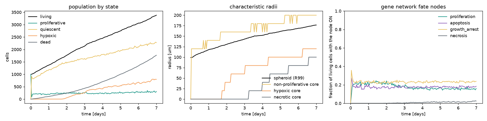
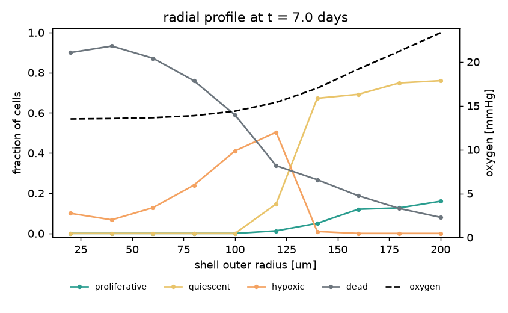

# Spheroid driven by MicroC's gene network (Milestone 11)

Run: `configs/tumor_spheroid_network.yaml` (seed 0, CPU, 2026-09-22): the metabolic spheroid
(oxygen, glucose, lactate as in `tumor_spheroid_metabolic.yaml`) with every cell running the
106-node Boolean network of Jayathilake et al. 2024 (`configs/networks/microc_jaya.bnd`,
MaBoSS format, unit rates, genes initially ON with probability ½, taken from the
OpenCellComms `MicroC` adapter). Asynchronous updates, 200 random single-node updates per
0.25 h step (≈ 2.5 MaBoSS time units; the network relaxes to its stationary statistics in
~40 units). Inputs: `Oxygen_supply = O > 15.7 mmHg`, `Glucose_supply = G > 4 mM`,
`MCT1_stimulus = L > 1.5 mM`, growth-factor stimuli (EGFR, cMET, FGFR) ON, TGFβ, DNA damage
and growth inhibitor OFF (MicroC's defaults). Phenotype model `network`: a cell may divide
while `Proliferation` is ON and `Growth_Arrest` OFF (0.1/h, not crowded), dies at 0.02/h
while `Apoptosis` is ON and at 0.2/h while `Necrosis` is ON; MicroC's environmental necrosis
rule (O₂ < 15.7 mmHg **and** glucose < 0.23 mM) stays active. 7 days, 110 s wall time, of
which the network is a few seconds (~10 µs per cell per step).

## Time course

| day | cells | living | PROLIFERATIVE | HYPOXIC (O₂ < 15.7) | dead | R99 [µm] | O₂ min [mmHg] | glucose min [mM] |
|---:|---:|---:|---:|---:|---:|---:|---:|---:|
| 1 | 1 476 | 1 370 | 190 | 0 | 106 | 118 | 17.4 | 4.85 |
| 3 | 2 570 | 2 134 | 239 | 260 | 436 | 143 | 13.4 | 4.81 |
| 5 | 3 752 | 2 750 | 250 | 545 | 1 002 | 162 | 13.0 | 4.81 |
| 7 | 5 148 | 3 381 | 308 | 797 | 1 767 | 177 | 13.4 | 4.81 |

Fate nodes ON among living cells (the new `network_*_cells` metrics):

| day | Proliferation | Apoptosis | Growth_Arrest | Necrosis (fraction of HYPOXIC cells) |
|---:|---:|---:|---:|---:|
| 1 | 0.21 | 0.20 | 0.24 | – |
| 3 | 0.17 | 0.18 | 0.23 | 0.03 |
| 5 | 0.17 | 0.18 | 0.23 | 0.05 |
| 7 | 0.16 | 0.18 | 0.24 | 0.10 |

Radial profile at day 7 (20 µm shells; glucose 4.81–4.89 mM and lactate 1.0 mM everywhere):

| shell outer [µm] | O₂ [mmHg] | cells | proliferative | quiescent | hypoxic | dead |
|---:|---:|---:|---:|---:|---:|---:|
| 40 | 13.6 | 74 | 0.00 | 0.00 | 0.07 | 0.93 |
| 80 | 13.9 | 358 | 0.00 | 0.00 | 0.24 | 0.76 |
| 120 | 15.4 | 860 | 0.01 | 0.15 | 0.50 | 0.34 |
| 160 | 19.2 | 1 323 | 0.12 | 0.69 | 0.00 | 0.19 |
| 200 | 23.3 | 25 | 0.16 | 0.76 | 0.00 | 0.08 |

## What the network does to the spheroid

1. **The network's stationary distribution sets the growth rate.** Under full stimulation
   the model does not settle on a fixed point: p53 is driven by p38 and held down by MDM2,
   which p53 itself induces (the p53–MDM2 negative feedback), so p53, ERK, p21 and the fate
   nodes keep cycling. At stationarity `Proliferation` is ON in ~20 % of well-supplied cells
   and 16 % of all living cells at day 7 (the crowded ones included), `Apoptosis` in 18 %,
   `Growth_Arrest` in 24 %. The effective division rate is therefore
   0.1/h × 0.16 ≈ 0.016/h and the population reaches 5 148 cells at day 7 against 10 368 for
   the rule-based metabolic spheroid — half the size, with R99 177 vs 218 µm.
2. **Apoptosis is spatially uniform and dominates death.** With `Apoptosis` ON in 18 % of the
   cells everywhere, the death rate is 0.02/h × 0.18 ≈ 0.004/h independent of position; the
   dead fraction is highest at the centre (0.9) simply because those cells are the oldest and
   never replaced, and it is 0.1–0.2 in the rim. Between day 1 and day 2 the apoptosis
   channel accounts for the 135 new deaths almost exactly (expected 129).
3. **Necrosis stays marginal.** The spheroid never becomes anoxic (O₂ min 13 mmHg, half the
   cells dead and consuming nothing) and glucose stays above 4.8 mM, so the environmental
   rule never fires and `Necrosis = ¬Oxygen_supply ∧ ¬Cell_Glucose` is ON only in the hypoxic
   core when `GLUT1` happens to be OFF — 3–10 % of the hypoxic cells, 83 cells at day 7. Its
   contribution to death grows in the last days (the necrosis channel expects ~270 of the 426
   deaths of day 7) but never forms a necrotic core.
4. **The metabolic switch works as in the paper.** In the hypoxic core (`Oxygen_supply` OFF)
   `mitoATP` goes OFF and `glycoATP` ON while `ATP_Production_Rate` stays ON, so
   `Proliferation` is unaffected by hypoxia as long as glucose is supplied (tests
   `test_microc_network_fates_follow_the_environment`); necrosis needs both to fail.

The comparison with the rule-based model is the point of the milestone: the rules give a
deterministic phenotype from thresholds, the network gives a *distribution* of phenotypes
per environment. Whether ~20 % proliferation and ~18 % apoptosis under full growth-factor
stimulation are what MicroC's own workflows produce depends on their propagation mode
(NetLogo graph walk with fate latching, not reproduced here) and on their initial states;
this run reports the MaBoSS-like semantics with the model's own `.cfg`.

## Caveats

* Rates in network mode are illustrative: the division rate *while ON* (0.1/h) and the
  apoptosis/necrosis rates were chosen so that the run is comparable in scale to the rule
  models, not fitted. MicroC divides proliferating cells after a cell-cycle time instead.
* Unit MaBoSS rates make the `maboss` and `asynchronous` modes the same process (tested);
  the model's original rate values, if any, are not in the files that were available.
* Lactate stays at the boundary value because there are few hypoxic cells; with a larger,
  denser spheroid (or the rule model's 5 000 hypoxic cells) the `MCT1_stimulus` input would
  switch. There is still no lactate uptake by oxygenated cells.
* `HYPOXIC` in network mode is the oxygen marker at the `Oxygen_supply` threshold (15.7
  mmHg), not the 8 mmHg of the rule model; the per-state uptake factors follow it.
